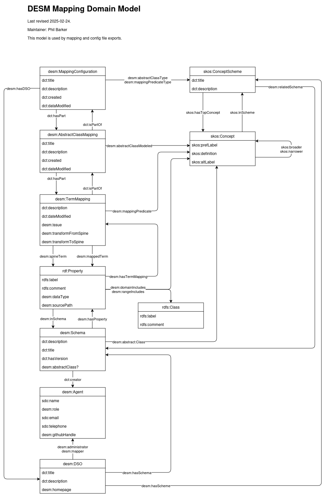

Data Ecosystem Mapping Tool (DESM) terms defined in

- [Turtle](desmTerms.ttl)
- [JSON-LD](desmTerms.jsonld)

There is also a JSON-LD context file:

- [Context file](context.json)

The Domain model is below:
